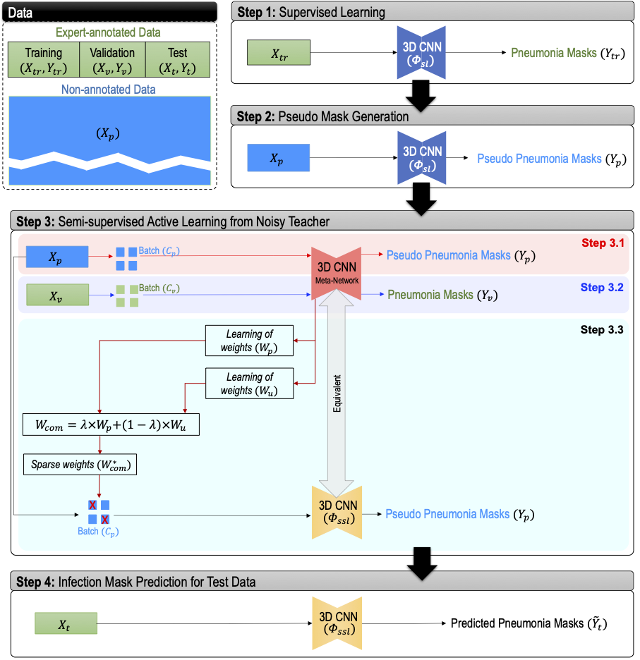

# Active Learning from Noisy Teacher (ALNT)

This is the code repository for our [paper](#cite) titled "[Active deep learning from a noisy teacher for semi-supervised 3D image segmentation: Application to COVID-19 pneumonia infection in CT](https://www.sciencedirect.com/science/article/pii/S0895611122000970)" that solves the problem of learning from big data without expert annotation by leveraging very small data with expert-annotation.  

[PDF Link](https://www.cs.sfu.ca/~hamarneh/ecopy/cmig2022.pdf) | [DOI](https://doi.org/10.1016/j.compmedimag.2022.102127)

## Repository layout
```
|- mymodule    # ALNT module source code of this paper, pluggable to other training routines
|- images
|- scripts     # A full code for training used in this paper (requires MONAI installation) 
```

## Motivation

- Although supervised deep learning has become a standard approach to solving medical image segmentation tasks, serious difficulties in attaining voxel-level annotations for sufficiently large volumetric datasets in real-life applications have highlighted the critical need for alternative approaches, such as semi-supervised learning.
- Most of the semi-supervised approaches combine expert annotations and machine-generated annotations with equal weights within deep model training, despite the latter annotations being relatively unreliable and likely to affect model optimization negatively. 
- To overcome this, we propose an active learning approach that uses an example re-weighting strategy, where machine-annotated samples are weighted (i) based on the similarity of their gradient directions of descent to those of expert-annotated data, and (ii) based on the gradient magnitude of the last layer of the deep model. 



## Brief Description of the Method
We design the working pipeline of the proposed method using the following steps: 
1. Initially, we generate voxel-level annotations (pseudo annotation) using supervised deep models (step 1 in figure above) while considering the fact that these machine-generated annotations are less reliable (noisy teacher) than human expert annotations (step 2 in figure above). 
2. Then we generate a relative weight based on gradients per sample based on its "trustworthiness" during training. A sample weight is estimated from the similarity of the gradient directions between the annotation-free sample data and the expert-annotated validation data (step 3 in figure above).
3. As the primary aim of an active learning algorithm is to identify and label only maximally-informative samples, gradient similarity-based sample weighting may lead to underestimation of a more diversely informative data sample. On the other hand, gradient magnitude with respect to parameters in the final CNN layer can be used as a measure of a model’s uncertainty. The higher magnitude of the gradient of the last layer, resulting from a higher loss of training, implies that the interrogated training sample contains newer information that the model has not yet seen. In our proposed approach, we adopt this gradient magnitude-based strategy and generate another set of sample weights based on their "informativeness" during training (step 3 in figure above).
4. Afterwards, we generate an overall sample weight by combining the "trustworthiness" and "informativeness" sample weights. 
5. Finally, we use a query mechanism to choose more informative and trustworthy samples in a batch of annotation-free data by rectification (i.e., choosing more useful data in a batch) of the combined sample weight, and subsequently use these combined sample weights in the batch during the model optimization.

## Table of contents
1. [Installation](#installation)
2. [Usage](#usage)
4. [Cite](#cite)


<a name="installation"></a>
### Installation
We used [MONAI](https://github.com/Project-MONAI/MONAI) framework for our experiments. To run ```scripts\train.py```, MONAI installation is required. Detailed instructions on how to install MONAI can be found [here](https://docs.monai.io/en/latest/installation.html).  


<a name="usage"></a>
### Usage
We also shared the code for the key algorithm (that runs inside the training loop) in ```mymodule\alnt.py```. 
- This code can be plugged into any training routine, after modifying lines 13 and 40 to load someone's own deep model. 
- To run as RGS method, assign ```alpha = 1``` in line 127 
- To run as RGM method, assign ```alpha = 0``` in line 127
- To run as RGS&M method, assign ```alpha = 0.5``` in line 127
- To run as RGS&M+AL method, uncomment line 128
- To find the gradient with respect to the last layer weights (for RGM, RGS&M, RGS&M+AL), find and replace the name of the last layer of your own model in line 68.

<a name="cite"></a>
### Cite
```bibtext
@article{hussain2022active,
  title={Active deep learning from a noisy teacher for semi-supervised 3D image segmentation: Application to COVID-19 pneumonia infection in CT},
  author={Hussain, Mohammad Arafat and Mirikharaji, Zahra and Momeny, Mohammad and Marhamati, Mahmoud and Neshat, Ali Asghar and Garbi, Rafeef and Hamarneh, Ghassan},
  journal={Computerized Medical Imaging and Graphics},
  pages={102127},
  year={2022},
  publisher={Elsevier}
}
```
